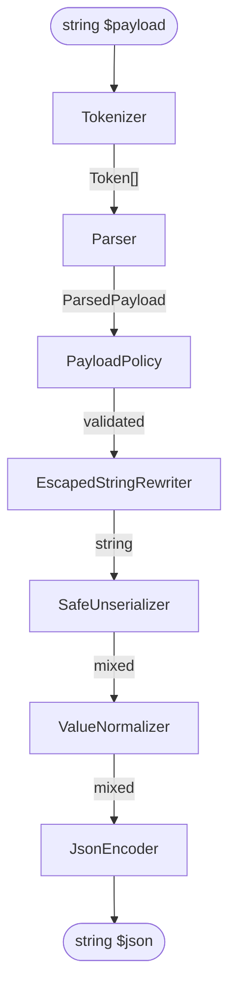

# Architecture

How `roelmagdaleno/serialized` is built and why. Read this before changing anything in `src/`.

The public API — the four verbs, the builder, the diagnostic codes — is documented in
[`README.md`](../README.md). The safety promise the package makes to its callers is in
[`SECURITY.md`](../SECURITY.md). This document is the internal view: the stages, their
boundaries, and the reasoning that holds them in place. Decisions with a rejected alternative
live in [`docs/adr/`](adr/README.md).

## What the package is

A framework-agnostic PHP 8.4 package that converts PHP serialized data into pretty-printed JSON,
safely, with error messages good enough to act on. It is built for arbitrary untrusted input —
WordPress meta, legacy session blobs, queue payloads, database columns, anything pasted in from
outside the application.

| Concern | Choice |
|---|---|
| Language | PHP `^8.4` |
| Runtime dependencies | None. `ext-json` and `ext-mbstring` only |
| Framework coupling | None. No `illuminate/*` in `require` or `require-dev` |
| Tests | Pest `^5.2` |
| Formatting | Laravel Pint `^1.32`, `laravel` preset |
| Static analysis | PHPStan `^2.2`, level `max`, over `src/` and `tests/` |
| Versioning | SemVer from git tags. No `version` field in `composer.json` |
| CI | None. `composer check` is the gate, run locally |

## The pipeline

Each stage is one class with one job, and no stage knows what comes after it.



| Stage | Does | Catches |
|---|---|---|
| `Tokenizer` | Lexes the payload into `Token[]` — type, offset, length. Lexes a byte range, so a `C:` body is lexed in place. Stops at `maxElements`, before the tokens are allocated. | Truncated tokens, bad length prefixes, unknown type letters, trailing bytes, element counts the remaining bytes cannot hold |
| `Parser` | Validates structure and derives `ParsedPayload` — depth, element count, class names, flags. | Unbalanced braces, wrong element counts, non-scalar array keys |
| `PayloadPolicy` | Applies `Options` against `ParsedPayload`. | Disallowed classes, references (`R:`/`r:`), non-UTF-8 strings, non-finite floats, depth |
| `EscapedStringRewriter` | Writes each `S:` escaped string as the plain `s:` string it spells, `C:` bodies included, because PHP 8.4 deprecated reading `S:`. A payload without `S:` passes through untouched. See [ADR 0017](adr/0017-rewrite-escaped-strings-before-unserialize.md). | — |
| `SafeUnserializer` | Calls `unserialize($payload, ['allowed_classes' => …])`. Wraps warnings as exceptions, never returns `false` silently; a notice or deprecation is left to PHP, not read as failure. | — |
| `ValueNormalizer` | Turns objects into `stdClass` with demangled property names, so private and protected properties survive encoding. | — |
| `JsonEncoder` | Calls `json_encode($value, $flags)`. | — |

`isValid()` stops after `PayloadPolicy`. `toArray()` stops after `SafeUnserializer` — it returns
the PHP value as PHP built it, objects and all, so a caller that wants the real object graph gets
it. Normalization is on the JSON path only.

`Serialized` is a thin delegator; all behaviour lives in `SerializedConverter`, which is
`readonly` and fluent. Every `with*`/`allow*`/`compact`/`pretty` method returns a new instance, so
a configured converter is safe to share, cache and bind in a container.

### Why tokenize before calling `unserialize()`

`unserialize()` reports only `Error at offset N of M bytes` — no reason, no fix. The tokenizer
knows the token type, the declared length and the actual length, which is what turns "offset 24"
into "declared 6 bytes, found 5 — change `s:6` to `s:5`".

The tokenizer is a gatekeeper, not a value producer: it decides whether `unserialize()` may be
called, and `unserialize()` still performs the conversion. `ParsedPayload` deliberately carries
only metadata — depth, counts, class names — never values. See
[ADR 0001](adr/0001-tokenize-before-unserialize.md).

### Custom-serialized (`C:`) bodies

A `C:` body is itself a serialized payload, so the three validation stages run over it again
before the payload is accepted — in place, at its real offsets, so a diagnostic still points at a
byte of the payload the caller passed. The body's depth and element count are spent from the same
budget as the payload around it, which is what stops a limit being split across the nesting. A
body that does not tokenize as one complete value is refused: the package cannot vouch for bytes
it cannot read, and `unserialize()` would hand them straight to the class. See
[ADR 0010](adr/0010-validate-custom-serialized-bodies.md).

### Why normalize before encoding

`json_encode()` serializes an object's **public** properties and silently drops the rest. An
allow-listed `Money` with a private `$amount` would therefore encode as `{}` — the package's
central promise, "show me what is in this payload", answered with an empty object and no error.

1. An object becomes a `stdClass`, never an array. An object whose property names are all numeric
   would otherwise encode as a JSON *array*, losing the object/array distinction the payload drew.
2. Property names are demangled by `PropertyName`: `\0Class\0name` (private) and `\0*\0name`
   (protected) both become `name`. A name still holding a NUL once demangled is refused before
   `unserialize()` runs; `PropertyName` owns that rule for both stages.
3. Colliding names are qualified as `Class::name`, never dropped.
4. Enums are passed through untouched — `json_encode()` already renders a backed enum as its value.
5. Arrays are walked recursively; scalars are returned as they are. Recursion terminates because a
   cycle can only be serialized as `r:` or `R:`, which `PayloadPolicy` rejects wherever it appears.
6. The class name is not added to the output.

Each of these is an ADR: [0005](adr/0005-normalize-objects-to-stdclass.md),
[0011](adr/0011-reject-unusable-property-names.md),
[0006](adr/0006-qualify-colliding-property-names.md),
[0007](adr/0007-omit-class-names-from-output.md).

## Where each guarantee is enforced

`SECURITY.md` states the promise; this table says which class keeps it, so a change to one of
these classes is a change to the security model.

| Guarantee | Enforced by |
|---|---|
| `allowed_classes` is never `true`, and reaches PHP in one normalized spelling | `ClassAllowList` |
| Objects and enums are rejected before `unserialize()` runs | `PayloadPolicy` |
| An allow-listed class PHP cannot load or rebuild is refused | `ClassRestorability` |
| References (`R:`/`r:`) are refused wherever they appear | `PayloadPolicy` |
| Values JSON cannot carry are refused | `JsonRepresentability` |
| `maxBytes`, before the payload is read | `PayloadPolicy` |
| `maxElements`, while lexing, before tokens are allocated | `Tokenizer` |
| `maxDepth`, once structure is known | `Parser` |
| Only `E_WARNING`/`E_USER_WARNING` mean `unserialize()` failed | `SafeUnserializer` |

Each limit is decided in exactly one place: element count where tokens are made, depth where
structure is known, byte length before either.

## Error handling

All exceptions implement `Serialized\Exceptions\SerializedException`, so callers can catch
everything or narrow to one case. The exception-to-cause mapping is in
[`README.md`](../README.md), together with every `DiagnosticCode` and the `context` keys it
carries.

Internally:

- Exception messages are built by named constructors on the exception
  (`InvalidSerializedDataException::lengthMismatch(...)`), never assembled at the throw site. A
  named constructor gathers the facts into a `Diagnostic`'s `context`.
- `DiagnosticCode` is the only place the default wording lives. `reason()` and `fix()` are methods
  on the enum, and a `Diagnostic` derives both from its code in its constructor, so the two can
  never disagree. See [ADR 0016](adr/0016-diagnostic-code-owns-wording.md).
- The byte `offset` is never duplicated into `context`; the `Diagnostic` already owns it.
- `SerializedException::diagnostic()` returns `?Diagnostic`, because `JsonEncodingException`
  cannot trace its failure to a byte. Every other exception narrows the return type and takes a
  `Diagnostic` in a private constructor, so catching a specific exception never needs a null check.
- The rendered snippet is always pure ASCII — unprintable bytes become `\xNN`, the truncation
  marker is `...` — so a byte offset into the snippet is also its display column, in any terminal
  and any encoding. `SnippetRenderer` is the only place it is drawn.
- `tryToJson()` catches `Throwable`, not just `SerializedException`. See
  [ADR 0004](adr/0004-trytojson-catches-throwable.md).

## Project structure

```
src/
  Serialized.php                          Static entry point; delegates to SerializedConverter
  SerializedConverter.php                 Immutable fluent builder; orchestrates the pipeline
  Options.php                             readonly value object: limits, allowed classes, JSON flags
  PropertyName.php                        readonly value object: a property's storage key, split

  Tokenizer/
    Tokenizer.php                         string → Token[]
    Token.php                             readonly: TokenType and offsets into the payload
    TokenType.php                         enum: Null, Boolean, Integer, Float, String, Array,
                                          Close, Object, CustomObject, Reference, ValueReference, Enum

  Parser/
    Parser.php                            Token[] → ParsedPayload; structural rules
    ParsedPayload.php                     readonly: depth, elementCount, classNames, referenceOffset,
                                          propertyNames (only those holding a NUL byte)
    StructureFrame.php                    One open array or object while the parser walks

  Policy/
    PayloadPolicy.php                     Applies Options to ParsedPayload
    ClassAllowList.php                    Owns the allowed-class decision
    ClassRestorability.php                Owns whether PHP can rebuild a named class
    JsonRepresentability.php              Rejects values JSON cannot carry

  Conversion/
    EscapedStringRewriter.php             S: escaped strings → s:, so PHP never reads the deprecated form
    SafeUnserializer.php                  Wraps unserialize() + error handling
    ValueNormalizer.php                   Objects → stdClass, property names demangled
    JsonEncoder.php                       Wraps json_encode() + flag handling

  Diagnostics/
    Diagnostic.php                        readonly: code, payload, offset, context, reason, fix
    DiagnosticCode.php                    enum: one case per failure + the default wording
    SnippetRenderer.php                   Renders the caret snippet
    DiagnosticMessage.php                 Assembles reason + snippet + fix into the message

  Exceptions/
    SerializedException.php               interface: diagnostic(): ?Diagnostic
    CarriesDiagnostic.php                 trait: private constructor + narrowed diagnostic()
    InvalidSerializedDataException.php
    UnsafeSerializedDataException.php
    UnrepresentableValueException.php
    LimitExceededException.php
    JsonEncodingException.php
```

Testing layout and the cases every change must keep covered are in
[`docs/testing.md`](testing.md).

## Deliberately out of scope

Not oversights. Each is additive and can ship later without breaking the 1.0 output.

- **`JSON → serialized`**, the reverse direction. Deferred to 1.1 or a companion package.
- **A Laravel service provider or facade.** Binding the converter takes a few lines in an
  application's own service provider. Revisit only if callers ask.
- **Coercion flags** (`->withInvalidUtf8Substitute()`, `->withNonFiniteAsNull()`). 1.0 rejects
  unrepresentable values outright.
- **Streaming or chunked parsing** for payloads larger than memory.
- **Emitting class names alongside normalized objects** (`->withClassNames()`, a `__class` key or
  an envelope).
